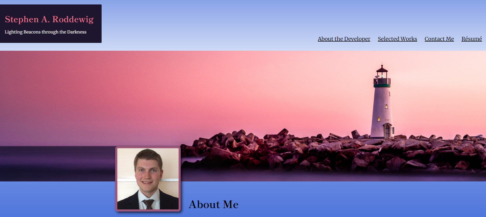

# Stephen A. Roddewig Portfolio Homepage

## Project Overview
Initial buildout of Stephen A. Roddewig Portfolio Page. Developer leveraged several responsive CSS methods, including flexbox for Header and Footer layout and CSS grid to style Selected Works grid with media queries to adapt layout to smaller screen sizes. In addition, developer leverager custom JS scrollCursor function to add interactive scrolling to different sections of DOM based on link clicked and custom JS to create mobile dropdown menu. Icons deployed on page are pulled from Font Awesome library, and fonts are pulled from Google Fonts library.

## Live Application
https://captain63.github.io/web-portfolio/ 

## Screenshot of Application

